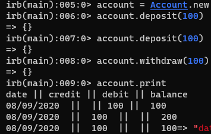

# Bank tech test

## Specification

#### Requirements
* You should be able to interact with your code via a REPL like IRB or the JavaScript console. (You don't need to implement a command line interface that takes input from STDIN.)
* Deposits, withdrawal.
* Account statement (date, amount, balance) printing.
* Data can be kept in memory (it doesn't need to be stored to a database or anything).

#### Acceptance criteria
* Given a client makes a deposit of 1000 on 10-01-2012
* And a deposit of 2000 on 13-01-2012
* And a withdrawal of 500 on 14-01-2012
* When she prints her bank statement
* Then she would see

```
date || credit || debit || balance
14/01/2012 || || 500.00 || 2500.00
13/01/2012 || 2000.00 || || 3000.00
10/01/2012 || 1000.00 || || 1000.00
```

## How to use
* Firstly clone this repo
* Then run `bundle`
* Now if you run `rspec`, the tests should run and show the coverage

## Technologies used
* I used simplecov with simplecov console to ensure I was testing enough of my code line by line
* I used RSpec as a testing framework
* I used rubocop to keep my code clean

## Plan
* To go about this challenge, I started by drawing up a rough [plan](plan.txt) 
* This plan enabled me to get started writing the code, I began with the printer as I thought I would be able to create an empty bank statement easiest.
* Then I moved onto the Account class which would just need a add and subtract method from the balance, then some way of storing this information -> I went with a new class AccountMemory to store the transactions in
* Finally, I moved back to the Printer where I added a new method whereby the stored data could be made into a statement when Account.print was called.

## Post feedback
* I went back to this piece of work after receiving some feedback.
* I extracted another class in order to greatly simplify my code, the hashes were not needed and I got rid of them
and in place used a class with similar attributes to store the data.
* I argued about including balance calculation elsewhere so I didnt have to store it each time. But it made sense to me to keep the calculation of balance within the account class, and have the other classes, simply storing and then printing numbers which they are told (rather than having any more logic)

## Image of use in IRB

